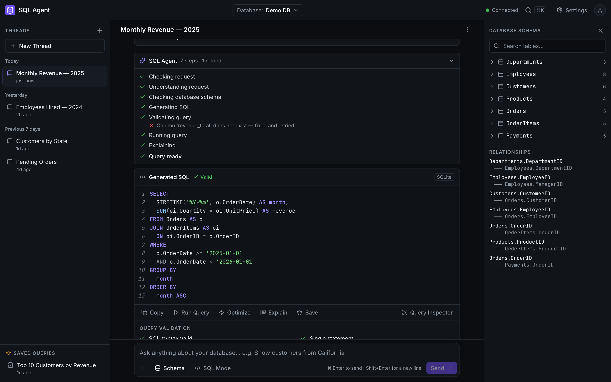
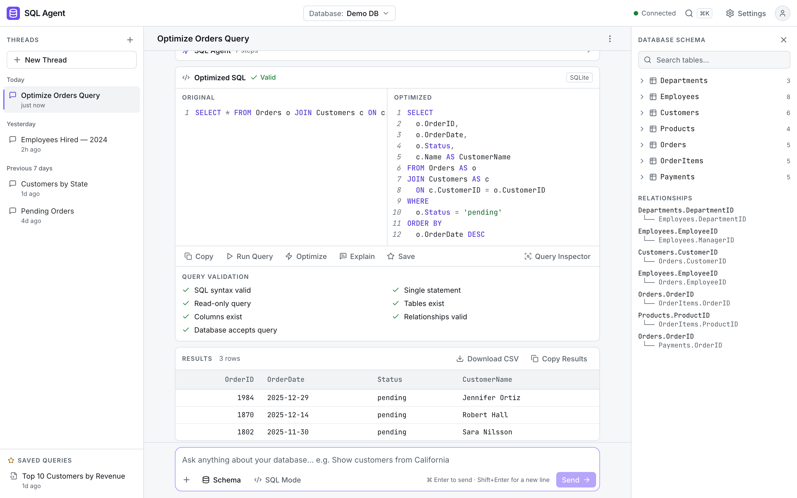
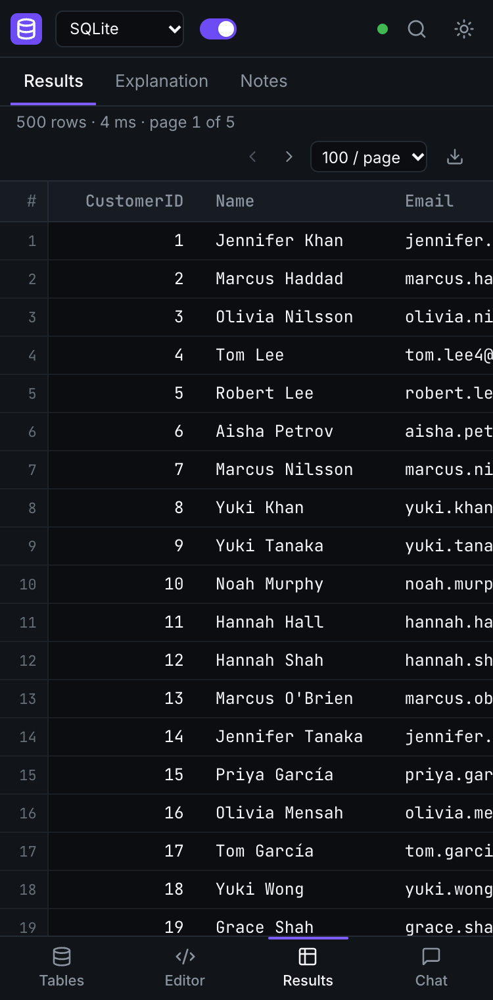

# SQL Agent — Frontend

A dark-first SQL copilot UI. Ask a question in plain English (or paste SQL) and watch the agent
work: live agent activity, validated read-only SQL with a validation checklist and query
inspector, results you can page through and export, and a plain-English "why this query?"
explanation — streamed from the backend over Server-Sent Events.

**Live demo:** https://sql-agent-frontend-delta.vercel.app — no login needed, just open it and ask. Backend: https://sql-agent-backend-rg9t.onrender.com (free tier, so the first request after idle can take ~30–60 s).

Backend repo: https://github.com/arpitgoyal20/sql-agent-backend-

> The backend runs on free hosting, so the first request after a while can take ~30 s while the
> server wakes up. The app shows a banner when that happens.

Design and API references:

- [`docs/UI_SPEC.md`](docs/UI_SPEC.md) — product and UI specification (layout, visuals, UX)
- [`docs/API_ADDITIONS.md`](docs/API_ADDITIONS.md) — v1.1 backend additions consumed by this UI
- [`REQUIREMENTS.md`](REQUIREMENTS.md) — original brief (§4 API contract, tech stack, quality bar)

## Screenshots

Dark (default), desktop — agent activity with a fixed-and-retried check, validated SQL card:



Light, desktop — optimize mode with Original vs Optimized side by side:



Mobile (375 px):



## Local setup

Requires Node 18+ (20 recommended).

```bash
npm install
cp .env.example .env      # set VITE_API_URL to your backend (default http://localhost:8000)
npm run dev               # http://localhost:5173
npm test                  # Vitest + React Testing Library
npm run build             # type-check and build to dist/
npm run lint              # ESLint
npx prettier --check .    # formatting
```

### Mock mode (no backend needed)

Set `VITE_MOCK=true` in `.env` (or run `VITE_MOCK=true npm run dev`). Everything works from
memory with the same event names and payloads as the real API (including the v1.1 fields):
chat replies are replayed from scripted SSE sequences; threads (list, load, rename, duplicate,
delete, generated titles), saved queries, `/api/execute`, `/api/schema` and `/api/health` are
served in memory and reset on page reload. Useful prompts:

- the four empty-state cards (Analyze shows a validation retry with the failing check, Explore,
  Debug SQL with Apply Fix, Optimize with Original vs Optimized)
- "Show all customers" (200 rows, paginated) then "Only those from California" (modify)
- "Show the top 10 customers by revenue", "delete all orders" (read-only refusal),
  "Who won the FIFA World Cup?" (out of scope), "show me the important ones" (clarify)
- "mock error" (error card with Try Again)

### Deployment

- **Vercel:** framework preset Vite, set `VITE_API_URL` to the Render backend URL, and add the
  Vercel domain to the backend's `ALLOWED_ORIGINS`. `vercel.json` rewrites all paths to
  `index.html`.
- **Docker (optional):**
  `docker build --build-arg VITE_API_URL=https://sql-agent-backend-rg9t.onrender.com -t sql-agent-frontend .`
  then `docker run -p 8080:80 sql-agent-frontend` (nginx serves `dist/`, see `nginx.conf`).

## Layout

| Width            | Layout                                                                     |
| ---------------- | -------------------------------------------------------------------------- |
| ≥ 1280 px        | Threads \| Chat \| Schema                                                  |
| 768 – 1279 px    | Threads \| Chat; schema opens as a right-hand drawer                       |
| < 768 px (phone) | Chat only; threads and schema drawers; SQL opens full screen from its card |

Top navigation: logo, **Database: Demo DB ▼**, **● Connected / ● Offline** (polls `/api/health`
every 30 s), **⌘K** search, **Settings** (theme, run queries automatically) and a guest avatar.

## Features mapped to the brief

| Brief item           | Where                                                                                                                                                                            |
| -------------------- | -------------------------------------------------------------------------------------------------------------------------------------------------------------------------------- |
| Chat interface       | Centre column: "You" cards and agent replies, empty state with four starter cards, composer (Enter / ⌘↵ sends, Shift+Enter newline, rotating placeholder, ＋ examples, SQL Mode) |
| SQL panel            | **SQL card** in each reply: highlighted SQL with line numbers, "✓ Valid", Copy / Run Query / Optimize / Explain / Save, warnings, debug "SQL ERROR", optimization report         |
| Explanation panel    | **WHY THIS QUERY?** under each reply: streams live, then the final text and assumptions                                                                                          |
| Conversation history | Threads sidebar grouped Today / Yesterday / Previous 7 days / Older; rename, duplicate, save, delete; ⌘K search; Query History per thread                                        |
| Loading indicator    | **Agent Activity** panel from `step` events (spinner, ✓, ↻ retry with the failing check, – skipped); skeletons; "Executing query..."; waking-up banner                           |
| Error messages       | Readable error card with the backend's text and Try Again; execution errors with View SQL / Try Again; refusals as a neutral grey shield card (not an error)                     |
| Copy SQL             | Copy on every SQL card ("Copied" for 2 s), index suggestions copyable individually                                                                                               |
| **Bonus**            |                                                                                                                                                                                  |
| Dark mode            | Dark by default, light theme in Settings, persisted in `localStorage`, no flash on load                                                                                          |
| Streaming            | SSE via `@microsoft/fetch-event-source`; activity, SQL, results and explanation tokens appear as they arrive                                                                     |
| Download CSV         | Results "Download CSV" (`results.csv`, RFC 4180 escaping) and "Copy Results" (tab-separated)                                                                                     |
| Syntax highlighting  | `react-syntax-highlighter` Prism light build, only `sql` registered, colours from the palette in both themes                                                                     |
| Multiple dialects    | "Database" menu: Demo Database / PostgreSQL / MySQL / SQLite → dialect sent with each request                                                                                    |

New in the redesign (UI_SPEC.md):

- **Agent Activity** — expandable "✦ SQL Agent" panel; expanded while running, collapsed when done;
  a retried check shows as "✕ Column 'revenue_total' does not exist — fixed and retried".
- **Intent indicator** — "↳ Modified previous query" for follow-ups; Optimize / Debug / Explain
  badges.
- **Query validation checklist** — from `sql.validation`; ⚠ with detail for warnings.
- **Query Inspector** — modal with tables, columns, joins, filters, aggregations, grouping,
  ordering, limit and safety, from `sql.inspection`.
- **Run Query** — `POST /api/execute` (no LLM), results inline under the card; also used to
  re-run SQL from a reloaded thread or a saved query.
- **Results** — sticky header, horizontal scroll, monospace, NULL greyed, 25 rows per page, row
  count and "Showing first 200 rows" when truncated.
- **Debug mode** — SQL ERROR (your query + problems) and the corrected SQL with Apply Fix (puts it
  in the composer in SQL mode) and Copy.
- **Optimize mode** — OPTIMIZATION REPORT (✓ notes and removed joins, ⚠ copyable index
  suggestions) and Original vs Optimized side by side (stacked on mobile).
- **Saved Queries** — save from a SQL card or a thread's menu; opening one shows the prompt, SQL,
  explanation, last execution time and fresh results; delete with confirm.
- **Query History** — chat header ⋮ → Query history: numbered prompts that produced SQL; click to
  scroll to and highlight that SQL card.
- **Schema Explorer** — search across tables and columns, expandable tables, 🔑 primary keys,
  types, Column Details (name, type, nullable, table, key, reference, doc) with Insert into query,
  and a RELATIONSHIPS list of every foreign key.
- **⌘K / Ctrl+K** — search palette for threads and saved queries (↑/↓, Enter).

## Project layout

```
src/
  api/          client.ts (REST + base URL, runtime mock switch), chatStream.ts (SSE → typed
                callbacks), types.ts (contract incl. v1.1), mock.ts (scripted SSE),
                mockRest.ts (in-memory REST), mockData.ts (fixtures, schema, crude inspector)
  context/      ThemeContext, ToastContext, UiContext (drawers, palette), ChatContext (threads,
                saved queries, turns, settings), chatModel.ts (pure model), execution.ts
  components/
    layout/     AppShell, TopNav, DatabaseMenu, SettingsMenu, CommandPalette, useHealth
    sidebar/    ThreadSidebar, ThreadItem, ThreadActionsMenu, InlineRename, SavedQueries
    chat/       ChatWorkspace, ChatHeader, QueryHistory, MessageList, UserMessage, AgentMessage,
                AgentActivity, SqlCard, ValidationPanel, QueryInspector, ResultTable,
                ExplanationPanel, DebugReport, OptimizationReport, RefusalCard, ErrorCard,
                EmptyState, Composer, SavedQueryView
    schema/     SchemaPanel (search, tree, column details, relationships)
    common/     CodeBlock, CopyButton, DownloadButton, Modal, Drawer, Switch, Logo, useDismiss
  utils/        csv.ts (CSV + TSV), download.ts, format.ts
```

## Tests

`npm test` runs 75 tests:

- `chatStream.test.ts` (28) — SSE handling: event order, `done`, errors, timeouts, mock replay
- `csv.test.ts` (10) — CSV escaping and TSV export
- `chatModel.test.ts` — activity-step merging with retry errors, error humanising, thread rebuild
- `SqlCard.test.tsx` — render, validation checklist with warnings, graceful degradation without
  v1.1 fields, Copy → "Copied" for 2 s, actions and Save → "Saved", side-by-side compare
- `QueryInspector.test.tsx` — opens from the card, lists the breakdown, Escape returns focus
- `ResultTable.test.tsx` — 25-row pagination, row count, truncation note, NULL, Copy Results
- `RefusalCard.test.tsx` — grey shield card, titles per reason, clickable suggestion
- `App.test.tsx` — flows against the in-memory mock: question → activity (with the retried
  check) → validated SQL card → results → explanation → generated thread title; follow-up shows
  "Modified previous query"; refusals; error + Try Again; rename / duplicate / delete; reload +
  Run Query; auto-run off + Run Query; save + open + delete a saved query; mock `/api/execute`
  rejects destructive SQL; schema search + column details + insert; PostgreSQL forces auto-run
  off; dark default + light persisted; ⌘K palette; Query History highlight; Apply Fix

## Assumptions

- **No authentication.** The avatar is a guest placeholder; threads and saved queries are shared
  by everyone using the backend.
- **"Database" selector maps to the dialect.** Demo Database and SQLite both send
  `dialect: "sqlite"` (and run against the demo database); PostgreSQL and MySQL send their
  dialect so the SQL is written for it. "+ Connect database" is a disabled placeholder marked
  "Coming soon".
- **Execution is SQLite-only.** "Run queries automatically" (default on) is forced off and
  disabled with an explanation when the dialect is not SQLite, and Run Query is disabled on
  non-SQLite SQL cards; the user's choice comes back when switching to SQLite again.
- **Run Query uses `POST /api/execute`** with the card's SQL and dialect. A result from the
  stream's `result` event is shown automatically. Execution failures show "Unable to execute
  query" with the backend's errors made readable (category prefix and hints removed).
- **Results are client-paginated at 25 rows per page**; the backend caps results at 200 rows and
  the UI shows "Showing first N rows" when `truncated`. No chart (UI_SPEC §12 makes it optional;
  omitted to keep the app from becoming a BI dashboard).
- **Refusal texts come verbatim from the backend**; the UI adds a title ("Read-only operation
  required" for `destructive`, "Outside my scope" for `out_of_scope`) and a clickable suggestion
  "Try asking something like: “Show the top 10 customers by revenue.”".
- **v1.1 fields are optional.** Without `validation` the checklist and "✓ Valid" badge are hidden;
  without `inspection` the Query Inspector button is hidden; "Modified previous query" also shows
  for `intent: "modify"`; a retry step without `errors` shows "A check failed".
- **Activity labels come from the backend** (`step.label`), one row per `node` in first-seen
  order with its latest status; "Query ready" is added when the turn produced SQL.
- **Persisted thread messages** are `{role, content, intent?, sql?, kind?, created_at?}`;
  assistant `content` is shown as the explanation, `kind: 'refusal'` / `'clarify'` as their cards.
  A reloaded SQL is labelled with the currently selected dialect (it is not persisted). Results,
  validation and inspection are not persisted; Run Query re-runs the SQL and fills them in.
- **Thread titles** come from `GET /api/threads` (refreshed after every `done`); a new thread shows
  its first message until the generated title arrives.
- **Save** stores the turn's prompt, SQL, dialect and explanation with the thread title (or the
  prompt for an unsaved thread). Saving from a thread's menu saves its latest SQL turn.
  Duplicate opens the copy.
- **Opening a saved query runs it immediately** via `/api/execute` (fast, read-only, no LLM).
  Optimize / Explain from a saved query, or typing in the composer there, start a new thread.
- **Query History** scrolls to and highlights the chosen SQL card rather than replacing the
  current SQL; "Compare with previous" is not implemented.
- **Debug "Apply Fix"** puts the corrected SQL into the composer in SQL Mode; it does not send.
- **Optimize / Explain buttons** send "Optimize this query:\n<sql>" / "Explain this query:\n<sql>"
  as a new message in the same thread.
- **Composer:** Enter or ⌘/Ctrl+Enter sends, Shift+Enter adds a line; pasting text that looks like
  SQL turns SQL Mode on; the ＋ menu fills the composer with an example (it does not send); the
  placeholder rotates every 4 s while the box is empty.
- **Starter cards send immediately** with concrete questions (Analyze → "Show monthly revenue for
  2025", etc.).
- **Retry / Try Again** removes the failed pair and resends the same text in the same thread.
- **Theme** is dark by default (UI_SPEC §28), light is opt-in and persisted in `localStorage`.
  The palette is defined as CSS variables; filled accent buttons use a slightly deeper shade of
  #7C5CFC (#6E4CF5) and accent text a lighter one (#A08BFF dark / #5B3FD6 light) so white text and
  accent text meet WCAG AA. Monospace ligatures are disabled so `>=` reads literally.
- **Fonts** Inter and JetBrains Mono load from Google Fonts with `display=swap`, falling back to
  system fonts offline.
- **Delete confirms** are inline (Delete / Cancel) rather than browser dialogs.
- **Mock mode:** replies are picked by keywords and replay fixed data; titles, the query
  inspector and `/api/execute` validation are regex imitations of the backend (destructive SQL is
  rejected with a `DESTRUCTIVE:` error and never "run"); data resets on reload.
- The CSV file starts with a UTF-8 byte-order mark so Excel opens non-ASCII text correctly.
